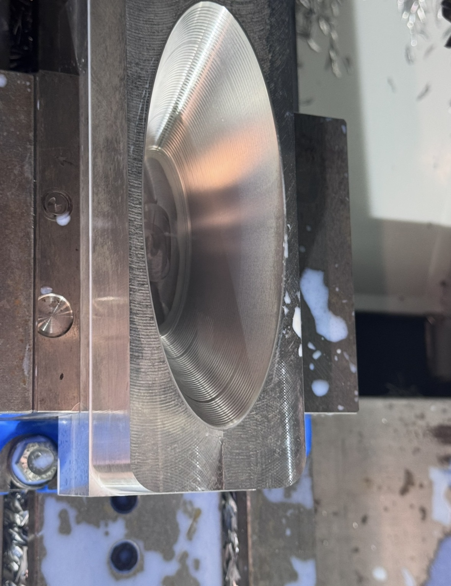
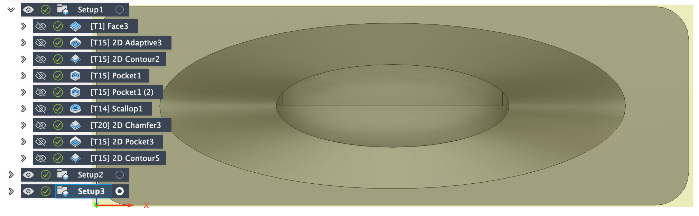
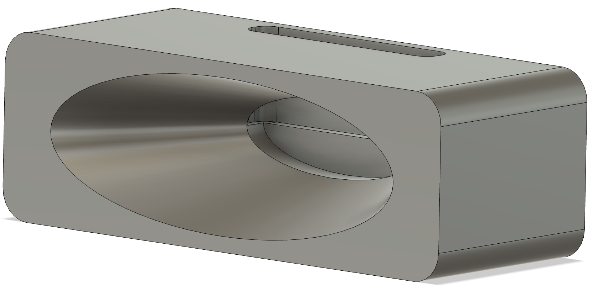
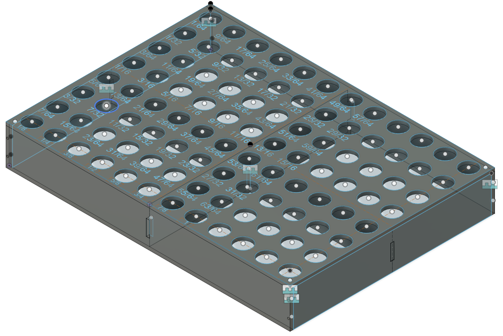

# Portfolio

## Lucca Nogueira Frey

Selected CAD, manufacturing, and shop tooling projects by Lucca Frey.

---

# Projects

## Press-Fit Welding Tip Assembly with Technical Drawings  
Transitioned from threaded to press-fit designs to simplify assembly and enhance modularity. Provided dimensioned drawings for manufacturing.

### Press-Fit Assembly (CAD Model)

  

### Technical Drawings (Base + Tip)

  
  

---

## Bending Mold for Tip Shaping  
Designed a precision mold to simultaneously bend all five welding tips post-machining, ensuring uniformity and fixed angles across tips.

  

---

## Manufactured Result  
Final copper tip assembly manufactured and shaped using the mold.

  
  

---
 

## Five-Tip Modular Welding Tool — Fusion 360 Model  
Developed a modular, press-fit assembly supporting five welding tips for simultaneous multi-cell welding, improving manufacturing efficiency.

  

---
 

## Angled Three-Tip Branch for Honeycomb Welding  
Designed an angled tip configuration for complex welding access, accommodating tight and misaligned honeycomb structures.

  

---
 

## Double-Tip Welding Holder — Fusion360 Assembly  
Designed for aerospace honeycomb tack welding. Consolidated welding tips to reduce cycle time and improve alignment consistency.

  

---
 

# Manufacturing & CAM

## CNC Machined Passive Phone Speaker — Haas MiniMill  
Machined an aluminum passive phone speaker as a CAM-focused project, setting up a Haas MiniMill tool library and running my first 3D toolpaths. Used this part to practice repeatable setup, surfacing strategy, and finishing quality.

### In-process (in vise)

  

### CAM Toolpaths (Fusion 360)

  

### CAD Model (Fusion 360)

  

---
 

# Shop Tooling & Organization

## Torque Wrench Holder — Fusion360 Model  
Created for UCSD’s machine shop to provide a secure and visible mounting point for torque wrenches, enhancing tool organization and lab ergonomics.

  

---

## Laser-Cut Collet Holder — Acrylic  
Designed a compact collet organizer for a lathe/mill setup. Laser-cut acrylic panels and aligned hole patterns to keep collets sorted, visible, and easy to access during setups.

  
  

dth="600"/>

