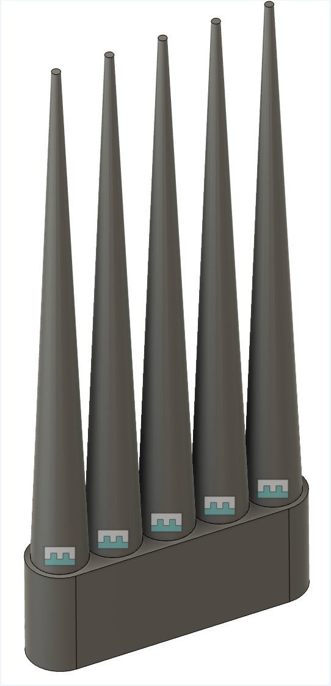
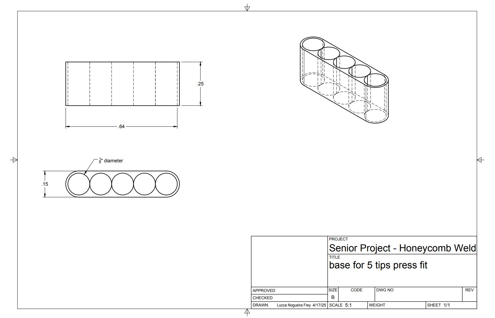
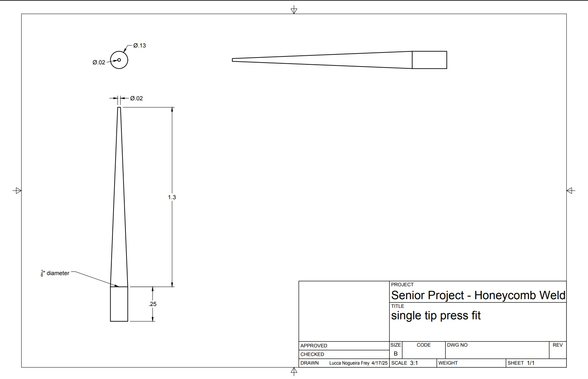
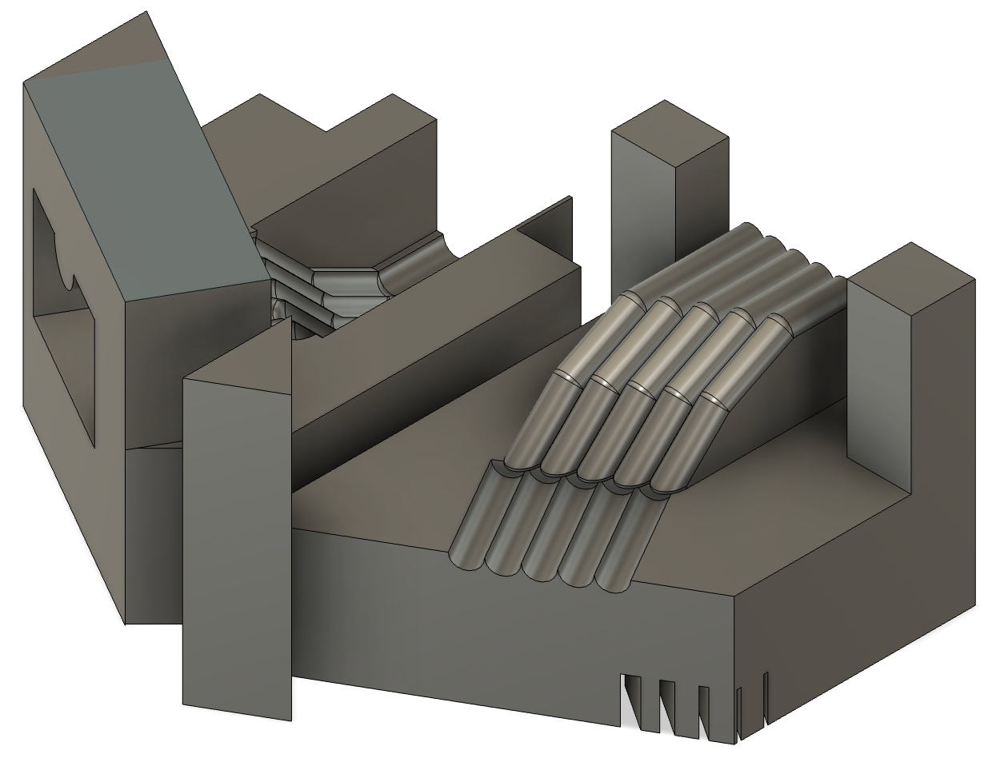
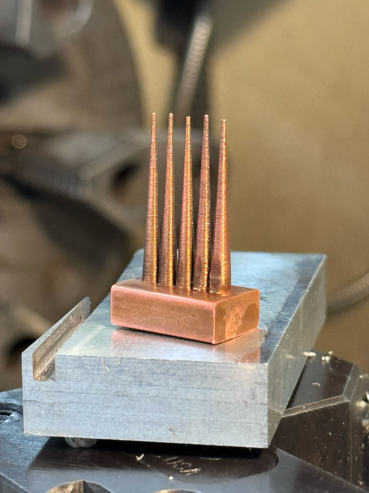
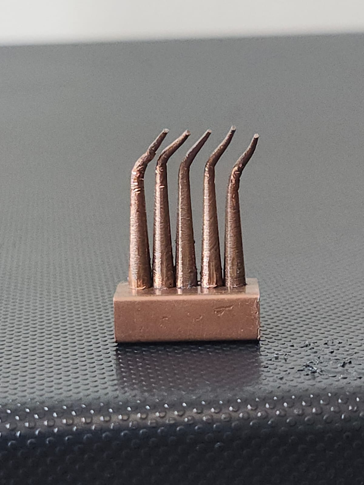
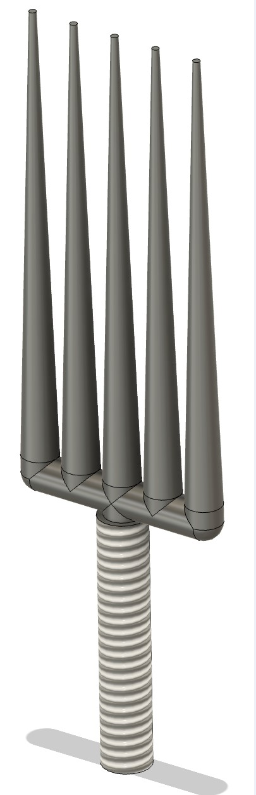
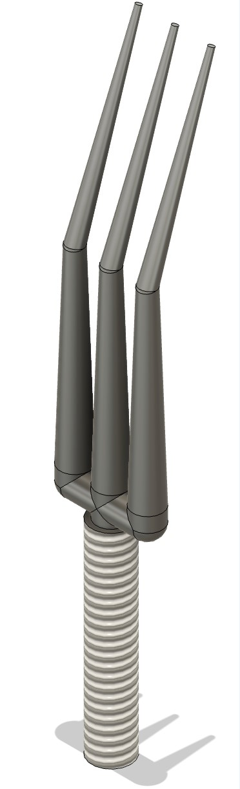
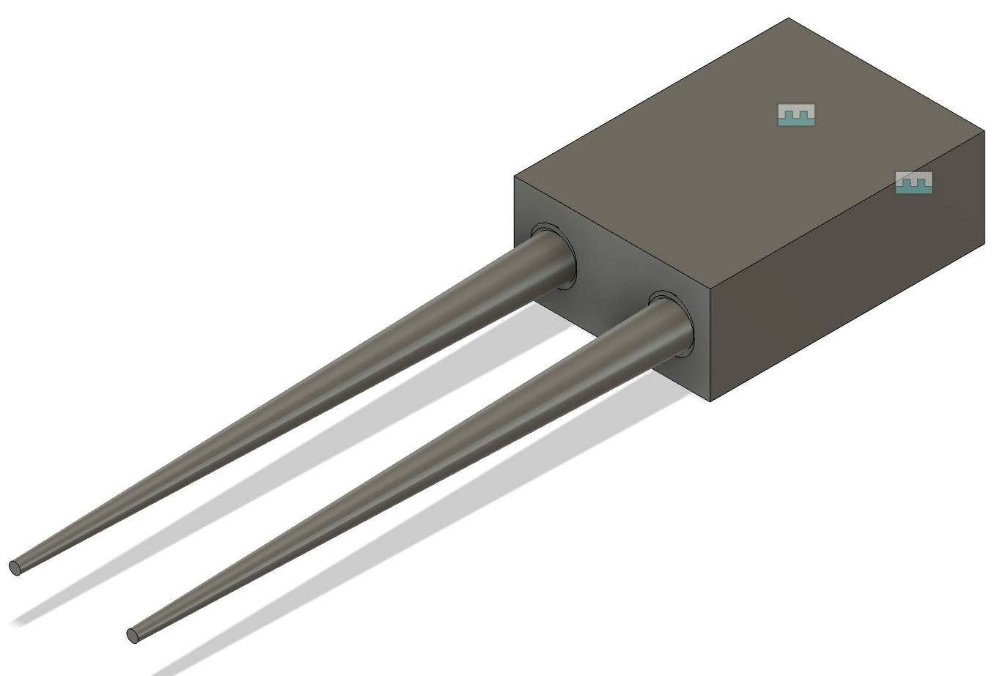
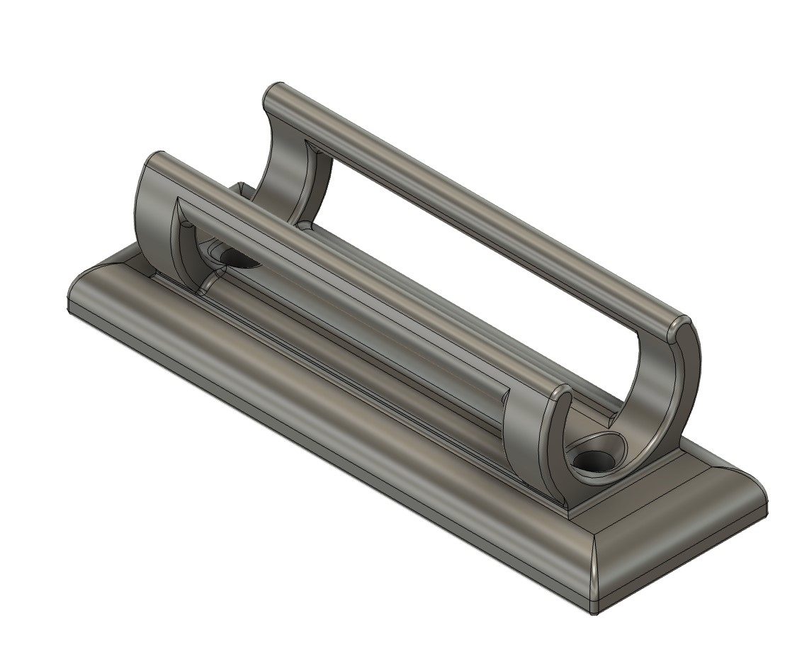

# Portfolio

## Lucca Nogueira Frey

Selected CAD and modeling projects by Lucca Frey.

---

# Projects

## Press-Fit Welding Tip Assembly with Technical Drawings  
Transitioned from threaded to press-fit designs to simplify assembly and enhance modularity. Provided dimensioned drawings for manufacturing.

### Press-Fit Assembly (CAD Model)  

  

### Base Component Drawing  

  

### Tip Component Drawing  

  

---

## Bending Mold for Tip Shaping  
Designed a precision mold to simultaneously bend all five welding tips post-machining. The tool guarantees uniformity and fixed angles across tips.

  

---

## Manufactured Result  
Final copper tip assembly manufactured and shaped using the mold.

  

  

---
 

## Five-Tip Modular Welding Tool — Fusion 360 Model  
Developed a modular, press-fit assembly supporting five welding tips for simultaneous multi-cell welding, improving manufacturing efficiency.

  

---
 

## Angled Three-Tip Branch for Honeycomb Welding  
Designed an angled tip configuration for complex welding access, accommodating tight and misaligned honeycomb structures.

  

---
 

## Double-Tip Welding Holder — Fusion360 Assembly  
Designed for aerospace honeycomb tack welding. Consolidated welding tips to reduce cycle time and improve alignment consistency.

  

---
 

## Torque Wrench Holder — Fusion360 Model  
Created for UCSD’s machine shop to provide a secure and visible mounting point for torque wrenches, enhancing tool organization and lab ergonomics.

  

