# Portfolio
## Lucca Nogueira Frey
Mechanical engineer focused on design for manufacturability, CNC machining, and tooling development. This portfolio highlights selected projects spanning electrode system design, CAM programming, shop tooling, and rocket engine manufacturing.

---

# Honeycomb Welding Electrode System
**Hi Tech Honeycomb — UCSD Senior Design Program**

Designed, tooled, and manufactured a modular welding electrode system for aerospace honeycomb panel production. The original welding tips cost ~$700 each and were sourced externally. I redesigned the system as press-fit copper assemblies that could be fabricated in-house, reducing the cost to ~$41 per unit.

The initial approach tried to preserve the existing threaded tip design — I started with a copper block that held two of the original threaded tips at 1/8" spacing. This failed for several reasons: the threading was unreliable and often out of tolerance, machining the male threads in-house was difficult, and the geometry didn't work — the rear mounting hole and the two tip holes intersected at 1/8" spacing, making the part impossible to manufacture.

That led to a full redesign using press-fit connections. Press-fit solved the geometric constraint, eliminated threading tolerance issues, and maintained reliable electrical contact for welding. At the same time, we moved away from the existing tack welders entirely and built a custom PLC-controlled setup, which gave us the freedom to redesign the electrode system from scratch.

---

## Modular 5-Tip Welding Tool
The core of the system — a press-fit assembly supporting five welding tips for simultaneous multi-cell welding. This replaced a single-tip approach, reducing cycle time and improving alignment consistency across honeycomb cells.

  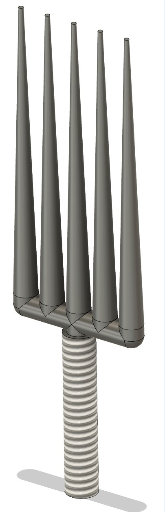

---

## Press-Fit Design and Technical Drawings
Each tip presses into a machined copper base block. The press-fit interface simplified assembly, reduced part count, and made tips quickly replaceable. Dimensioned drawings were provided for repeatable manufacturing.

### Press-Fit Assembly (CAD Model)

  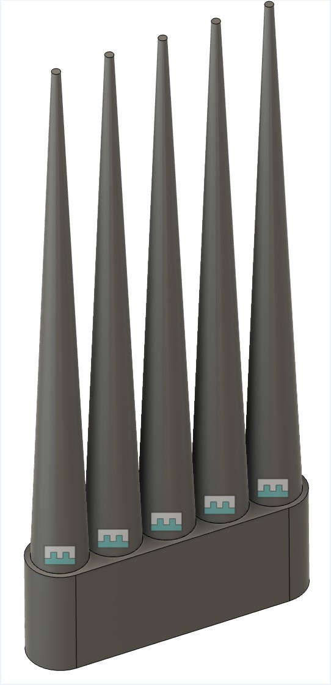

### Technical Drawings (Base + Tip)

  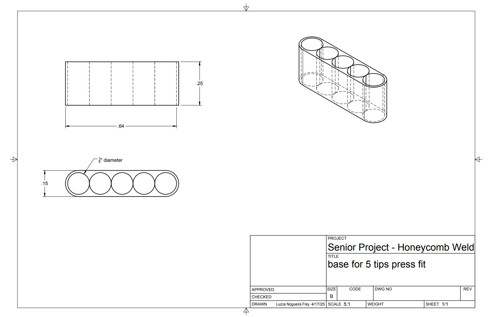
  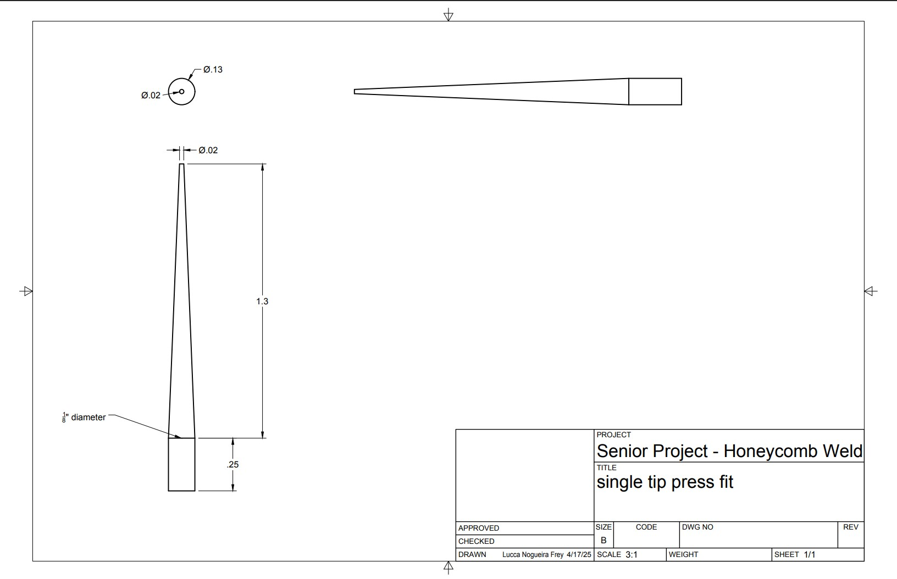

---

## Bending Mold for Tip Shaping
After machining, all five tips needed to be bent to match the honeycomb cell geometry. Bending by hand produced inconsistent angles, so I designed a precision mold that bends all five tips simultaneously. This ensured uniform angles across every set and made the bending process repeatable.

  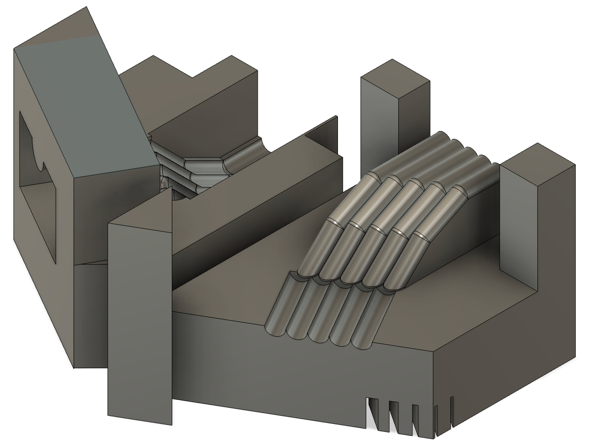

---

## Manufactured Result
Final copper tip assemblies — machined, press-fit into the base, and shaped using the bending mold. These replaced the $700 externally sourced tips at a fraction of the cost.

  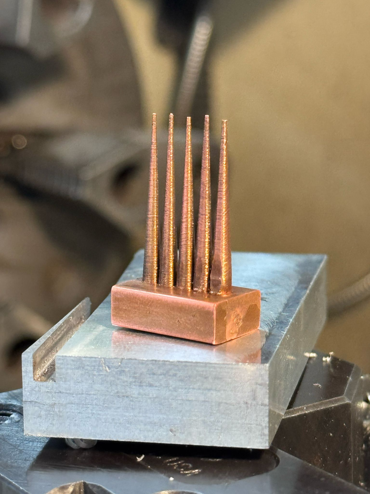
  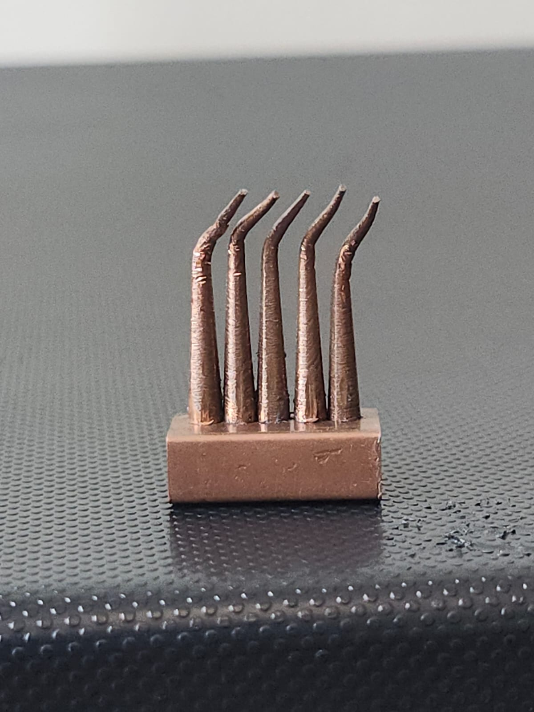

---

## Design Iterations — Alternate Tip Configurations
Beyond the 5-tip system, I designed alternate configurations to handle different welding access requirements on the honeycomb panels.

### Angled Three-Tip Branch
Designed for areas where the standard straight approach couldn't reach. The angled configuration accommodates tight and misaligned honeycomb structures.

  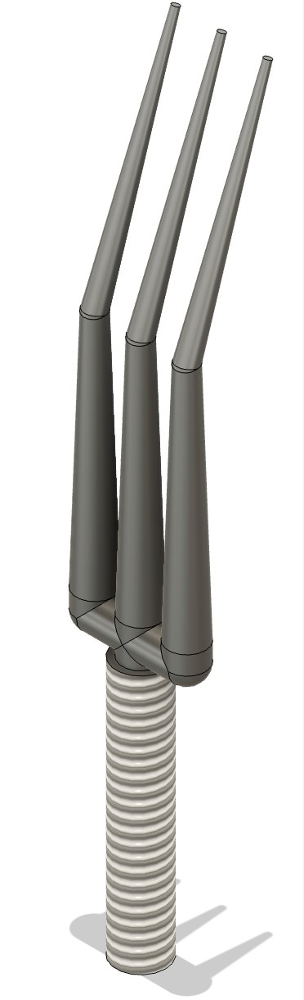

### Double-Tip Welding Holder
A consolidated two-tip holder for tack welding operations where fewer simultaneous welds were needed. Reduced cycle time compared to single-tip while keeping the system compact.

  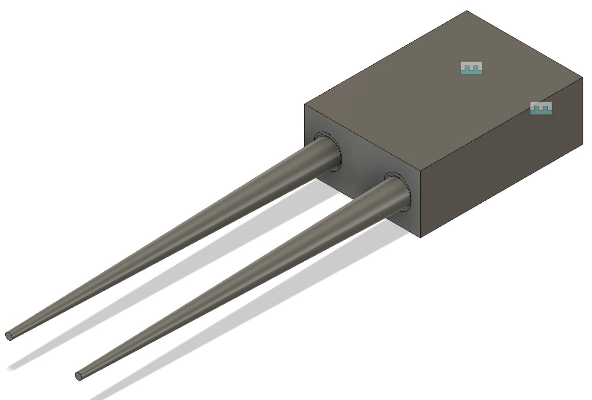

---

# CNC Machined Passive Phone Speaker — Haas MiniMill
Designed and machined an aluminum passive phone speaker from scratch, based on a speaker my dad had at home. I modeled it from memory in Fusion 360, adapted the geometry to what made sense for CNC, and used it as my first 3D CAM project on the Haas MiniMill. This part was about building a tool library, practicing multi-setup machining, and developing a feel for surfacing strategy and finishing quality on contoured geometry.

### In-Process (in vise)

  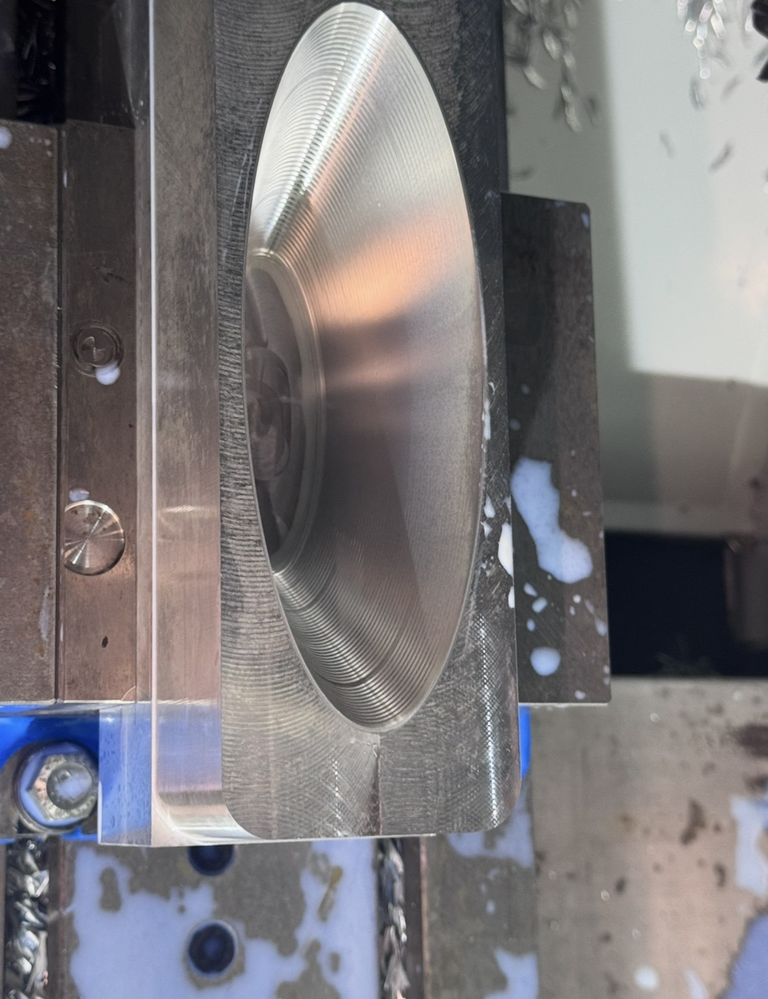

### CAM Toolpaths (Fusion 360)

  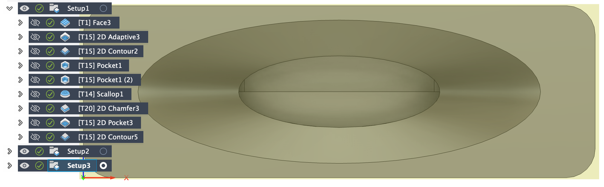

### CAD Model (Fusion 360)

  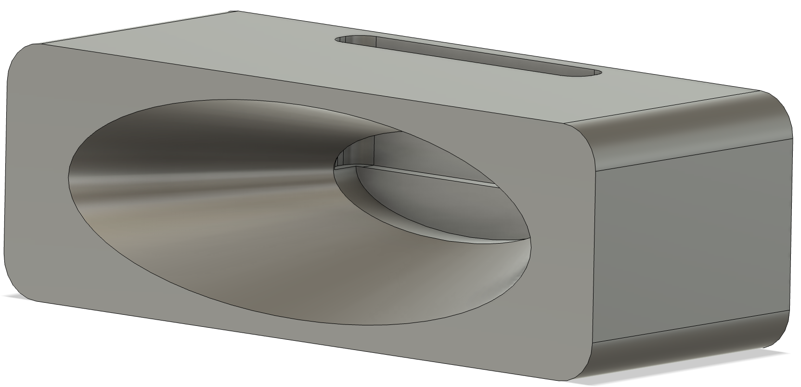

---

# Shop Tooling & Organization
Projects built for the UCSD machine shop to improve tool access and workflow.

## Laser-Cut Collet Holder — Acrylic
Designed a compact collet organizer for the shop's lathe and mill stations. Collets were previously stored loose in drawers, making it hard to find the right size during setups. Laser-cut acrylic panels with aligned hole patterns keep collets sorted by size, visible at a glance, and easy to grab during tool changes.

  
  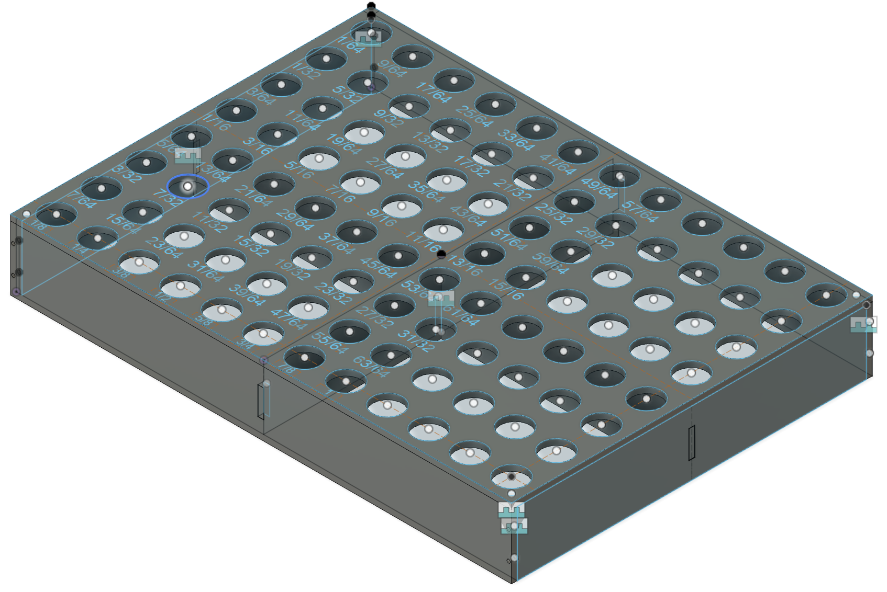

## Torque Wrench Holder
Designed a wall-mounted holder to keep torque wrenches visible, accessible, and secure. Built to solve the problem of wrenches getting buried in drawers or left on machines between setups.

  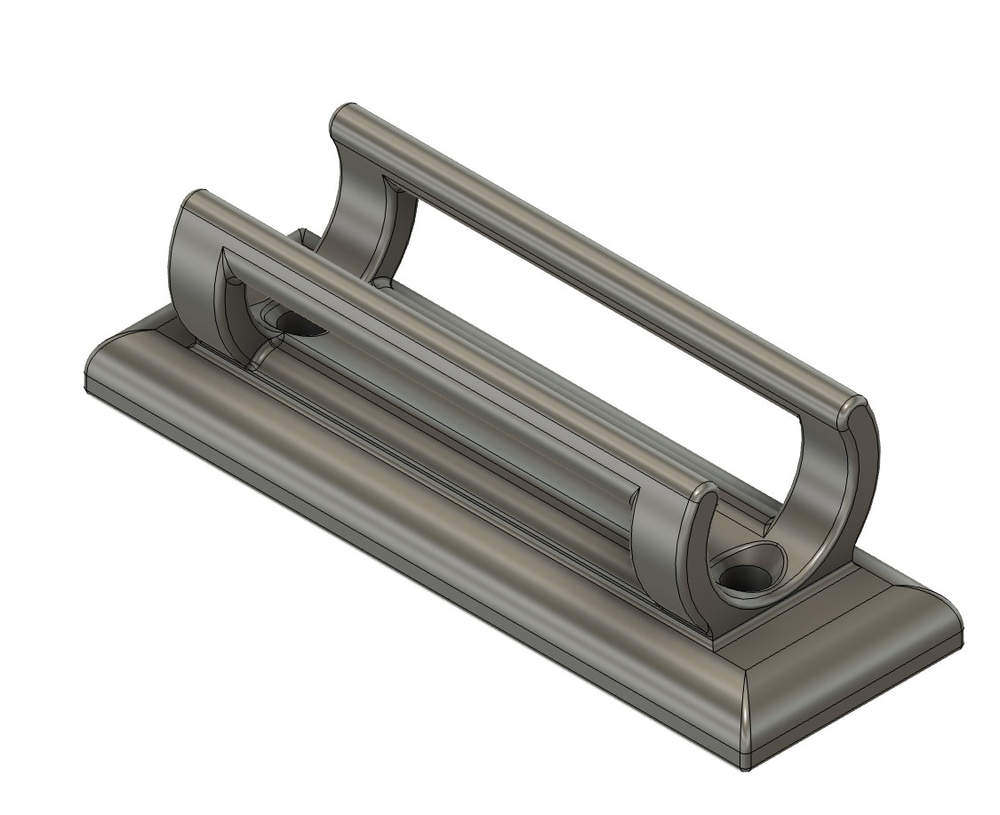

---

# SEDS UCSD — Rocket Engine Manufacturing
**Team Machinist — Rocket Propulsion Team**

Manufacturing a regeneratively-cooled rocket engine from an existing design. The work involves CNC lathe operations for inner and outer contour profiling, 4th-axis slitting saw operations to cut the regenerative cooling channels, and custom fixture and tooling fabrication to support non-standard setups. Prototyping in aluminum before transitioning to copper for final production.

<!-- Uncomment these image tags as you add photos to the repo:

### After Lathe Profiling

  

### 4th-Axis Setup

  

### Final Result

  

### Custom Arbor Saw Holder

  

-->

*Photos coming soon.*
