# Portfolio
## Lucca Nogueira Frey
Mechanical engineer focused on design for manufacturability, CNC machining, tooling development, and manufacturing process optimization. This portfolio highlights selected projects spanning aerospace welding tooling, CNC manufacturing, CAM programming, shop tooling, and regeneratively cooled rocket engine machining.

---

# SEDS UCSD — Regeneratively Cooled Rocket Chamber
**Rocket Propulsion Team — Team Machinist**

Manufactured a regeneratively cooled rocket chamber prototype using CNC turning and 4th-axis machining operations. The chamber required deep internal boring, precision external contouring, and indexed slitting operations to create regenerative cooling channels around the combustion chamber geometry.

The manufacturing process combined TL-1 lathe operations for internal and external contour profiling with VF-2 4th-axis machining for the external cooling channels. Due to the chamber's length-to-diameter ratio and thin internal geometry, custom workholding and process adaptations were required to maintain rigidity and concentricity throughout machining.

The external cooling channels were machined using indexed slitting operations on the 4th axis, requiring careful setup alignment and fixture design to maintain consistent channel spacing and surface finish across the full chamber profile.

---

## Engineering Drawing
Overall chamber drawing showing combustion chamber geometry, cooling channel layout, and critical dimensions used throughout the manufacturing process.

  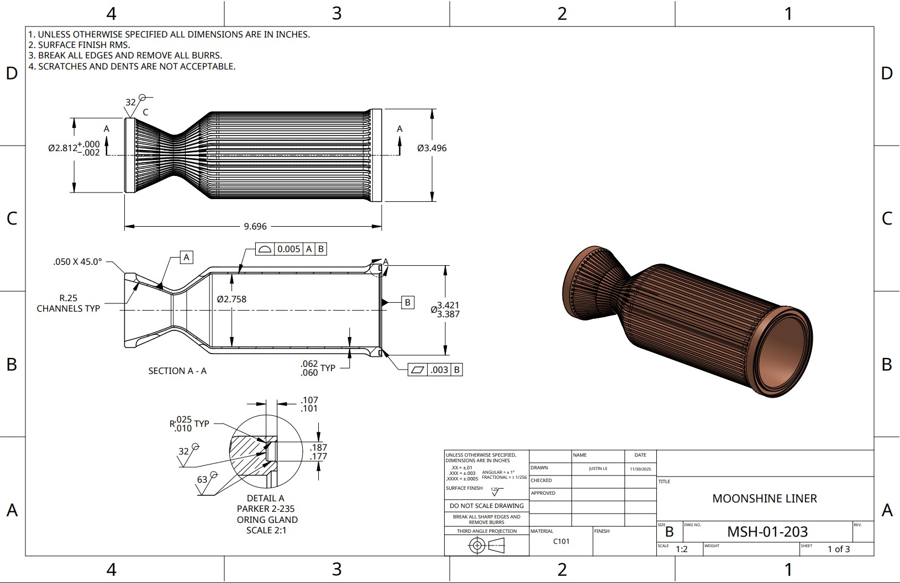

---

## TL-1 Turning & Internal Profiling
Initial turning and contour profiling operations performed on the TL-1 lathe before transitioning to 4th-axis machining.

  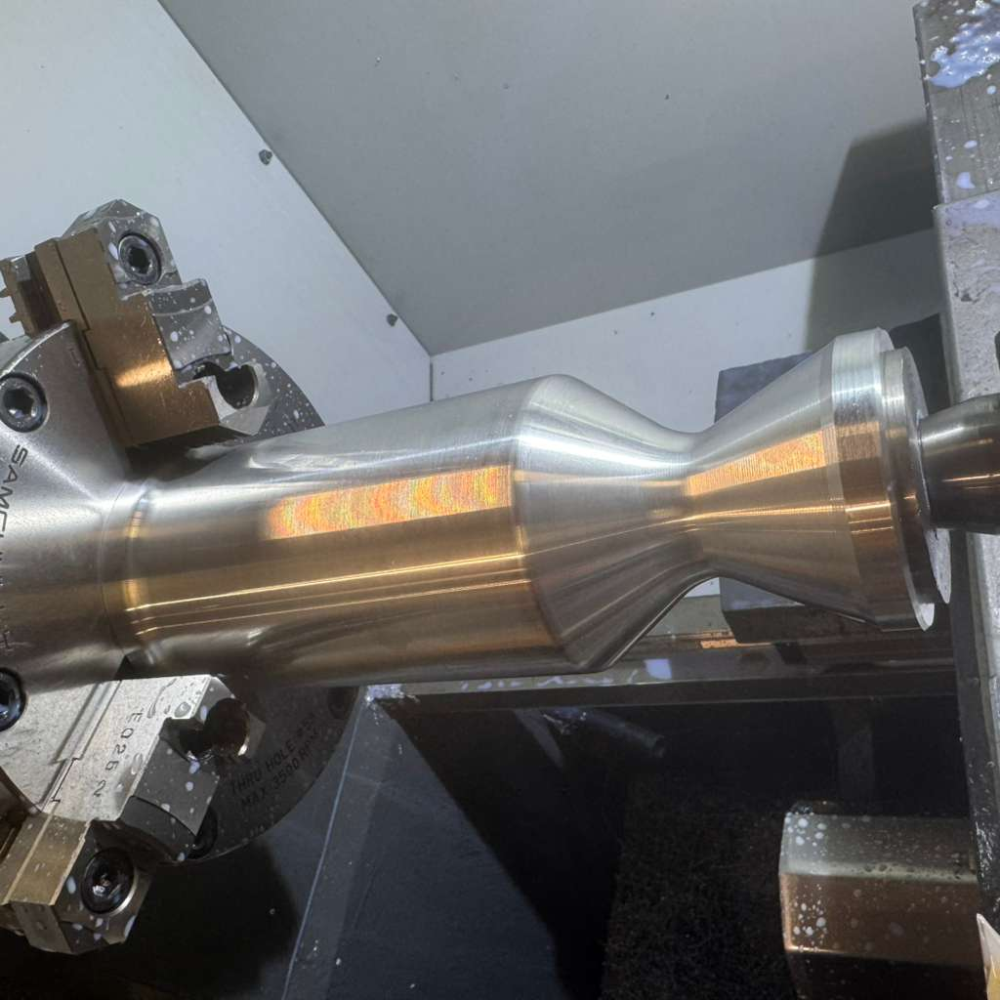

---

## Chamber Before Cooling Channel Machining
Completed external contour profile before machining the regenerative cooling channels.

  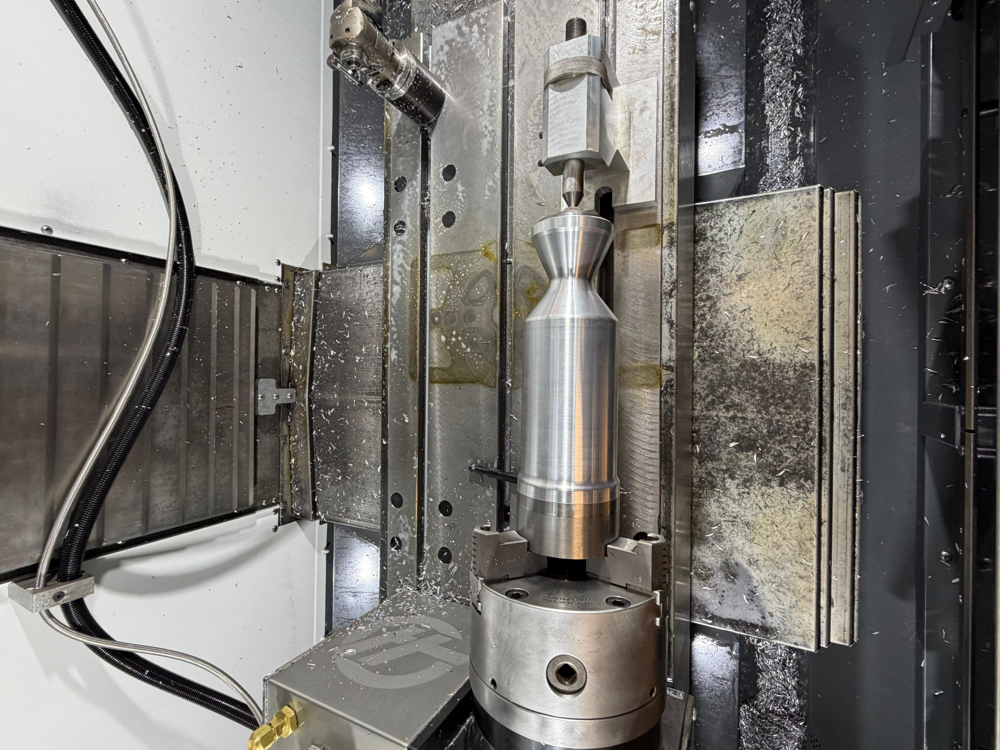

---

## VF-2 4th-Axis Setup
Custom fixturing and tailstock support used during indexed slitting operations to machine the regenerative cooling channels.

  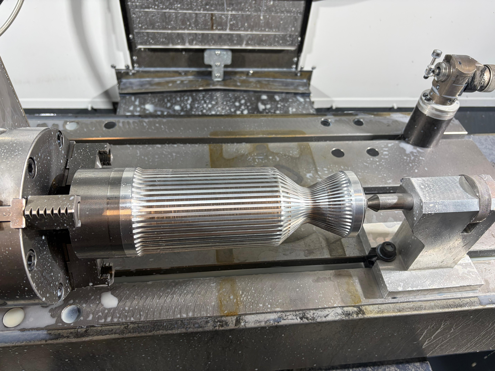

---

## Cooling Channel Machining Close-Up
Detail view of the regenerative cooling channels after 4th-axis slitting operations.

  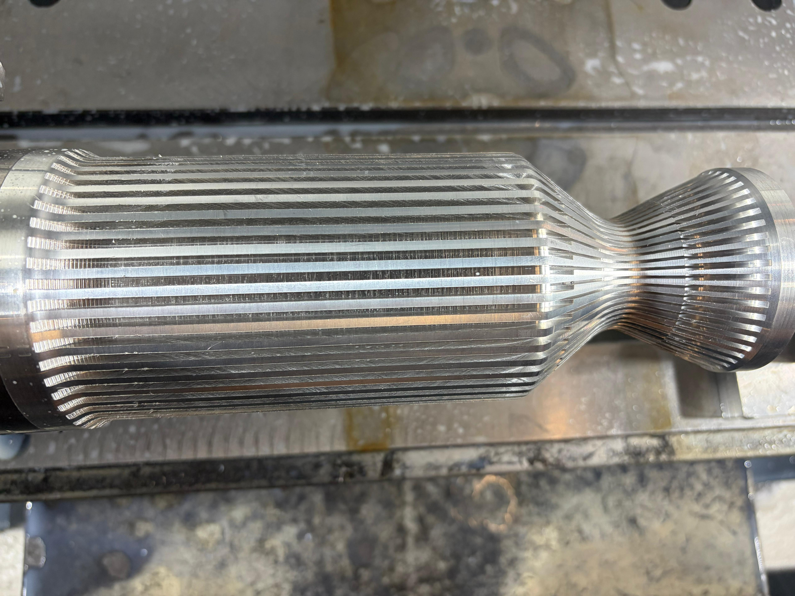

---

## Final Machined Chamber
Completed aluminum prototype after contour profiling and regenerative cooling channel machining.

  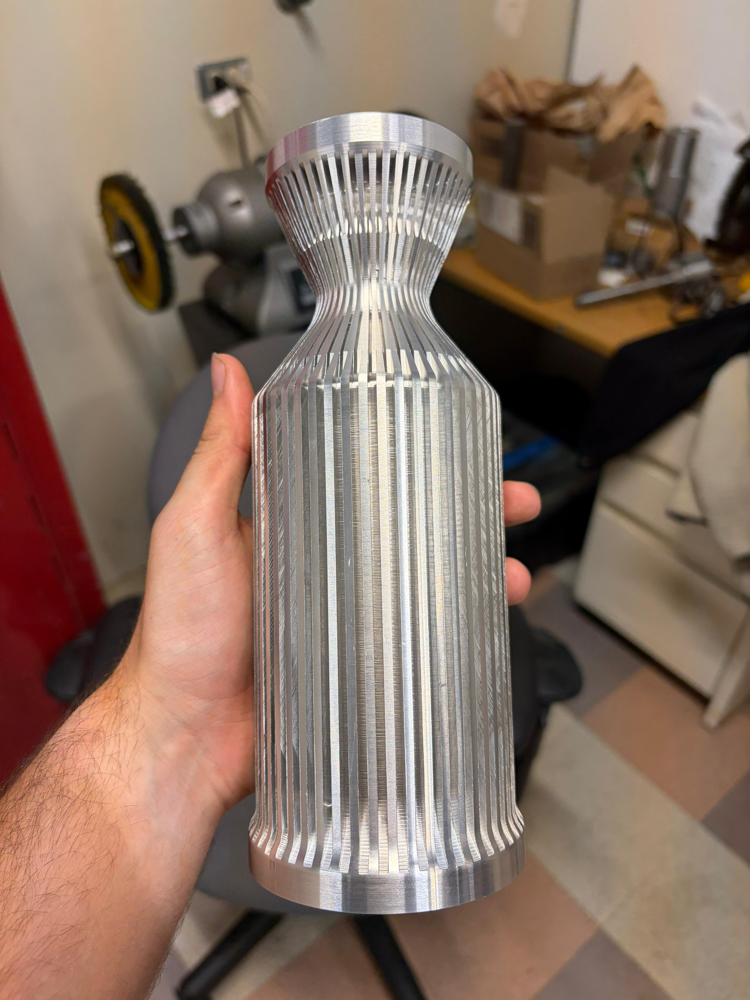

---

## Manufacturing Challenges
- Deep internal boring with limited rigidity due to the chamber's long internal geometry
- Maintaining concentricity between the internal bore and external cooling channels
- Designing stable workholding for long 4th-axis machining operations
- Managing thin-wall deformation during turning and slitting operations
- Maintaining consistent cooling channel spacing across the full chamber contour

---

# Honeycomb Welding Electrode System
**Hi Tech Honeycomb — UCSD Senior Design Program**

Designed, tooled, and manufactured a modular welding electrode system for aerospace honeycomb panel production. The original welding tips cost approximately $700 each and were sourced externally. I redesigned the system as press-fit copper assemblies that could be fabricated in-house, reducing the cost to approximately $41 per unit.

The initial approach attempted to preserve the existing threaded tip design. I started with a copper block holding two original threaded tips at 1/8" spacing. This failed for several reasons: the threading was unreliable and often out of tolerance, machining the male threads in-house was difficult, and the geometry itself became impossible to manufacture because the rear mounting hole intersected with the tip holes.

That led to a complete redesign using press-fit connections. Press-fit solved the geometric constraint, eliminated threading tolerance issues, and maintained reliable electrical contact for welding. At the same time, we moved away from the original tack welders and developed a custom PLC-controlled setup, allowing the electrode system to be redesigned entirely around manufacturability and repeatability.

---

## Modular 5-Tip Welding Tool
The core of the system — a press-fit assembly supporting five welding tips for simultaneous multi-cell welding. This replaced a single-tip approach, reducing cycle time and improving alignment consistency across honeycomb cells.

  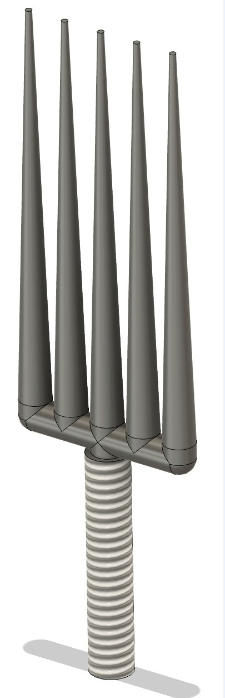

---

## Press-Fit Design and Technical Drawings
Each tip presses into a machined copper base block. The press-fit interface simplified assembly, reduced part count, and made tips quickly replaceable. Dimensioned drawings were created to support repeatable manufacturing and assembly.

### Press-Fit Assembly (CAD Model)

  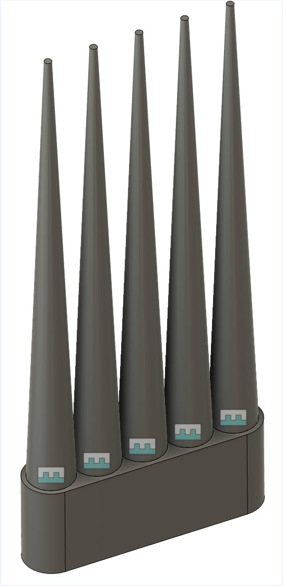

### Technical Drawings (Base + Tip)

  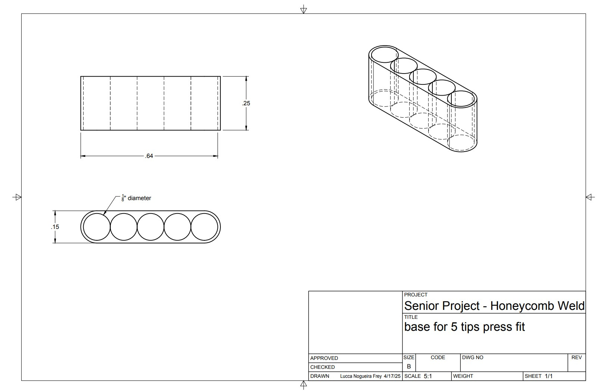
  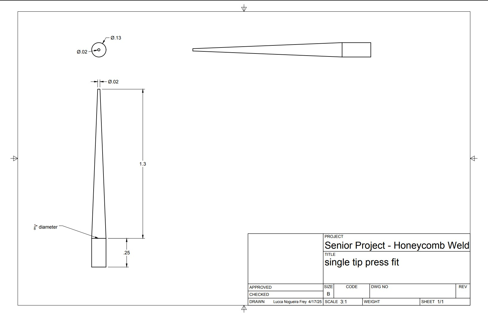

---

## Bending Mold for Tip Shaping
After machining, all five tips needed to be bent to match the honeycomb cell geometry. Bending by hand produced inconsistent angles, so I designed a precision mold capable of bending all five tips simultaneously. This ensured repeatable geometry and significantly improved consistency between assemblies.

  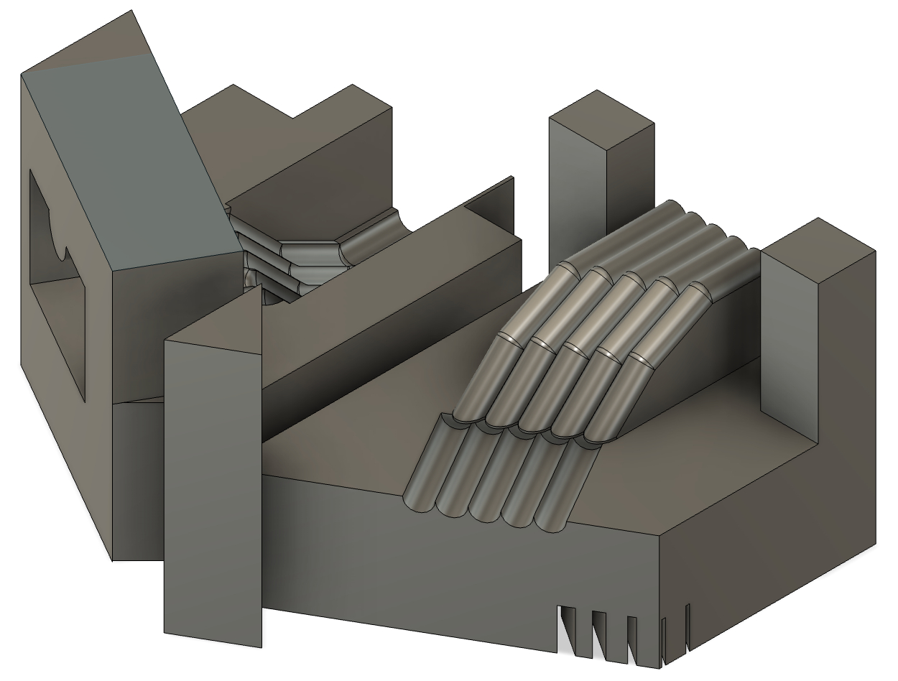

---

## Manufactured Result
Final copper tip assemblies after machining, press-fit assembly, and bending operations.

  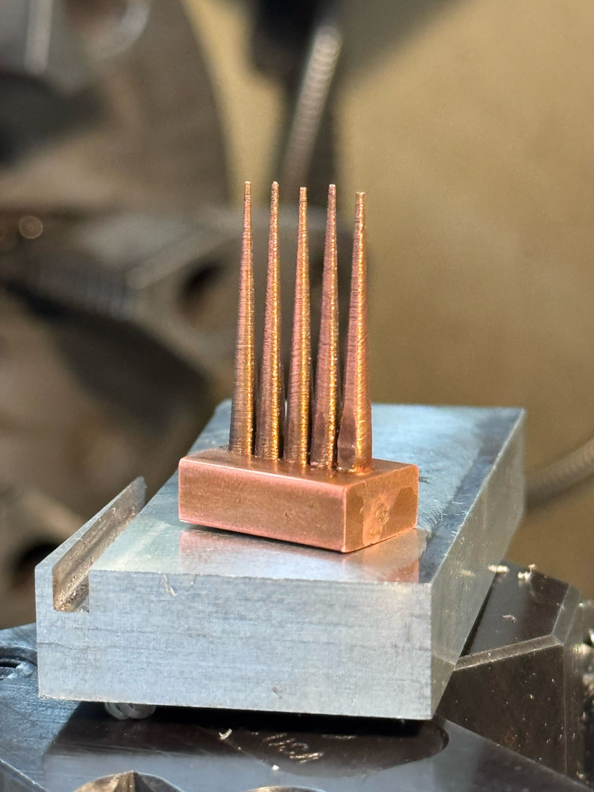
  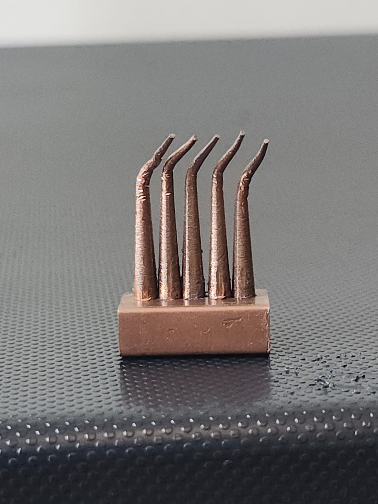

---

## Design Iterations — Alternate Tip Configurations
Beyond the 5-tip system, I designed alternate configurations to support different welding access requirements across the honeycomb structures.

### Angled Three-Tip Branch
Designed for areas where the standard straight approach could not reach. The angled configuration accommodated tighter and misaligned honeycomb geometries.

  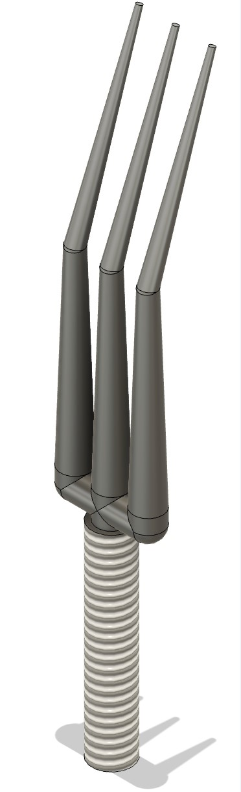

### Double-Tip Welding Holder
A compact two-tip configuration developed for operations where fewer simultaneous welds were needed while still reducing cycle time compared to single-tip welding.

  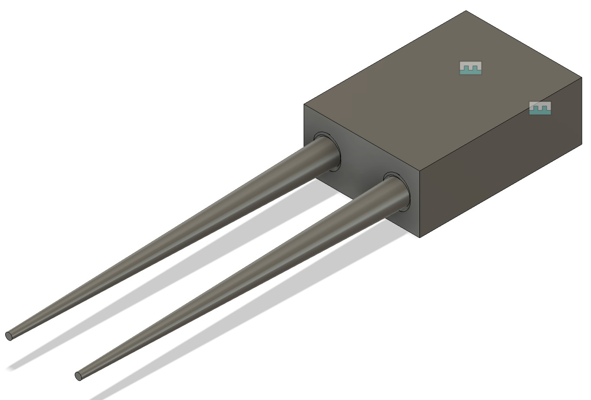

---

# CNC Machined Passive Phone Speaker — Haas MiniMill
Designed and machined an aluminum passive phone speaker from scratch based on a speaker my dad had at home. I recreated the geometry from memory in Fusion 360, adapted it for CNC manufacturability, and used the project to develop CAM workflows and multi-setup machining strategies on the Haas MiniMill.

This project focused heavily on surfacing strategy, toolpath optimization, and machining finish quality on contoured geometry.

### In-Process (in vise)

  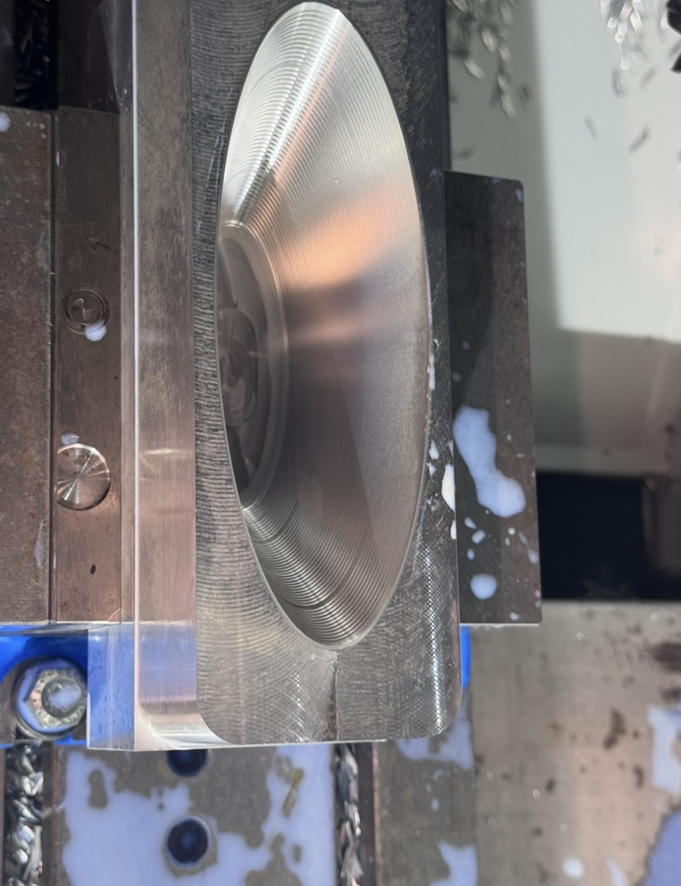

### CAM Toolpaths (Fusion 360)

  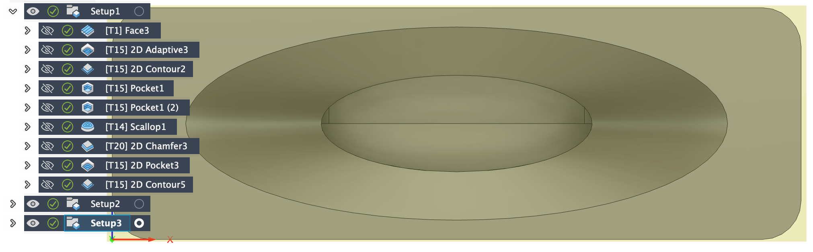

### CAD Model (Fusion 360)

  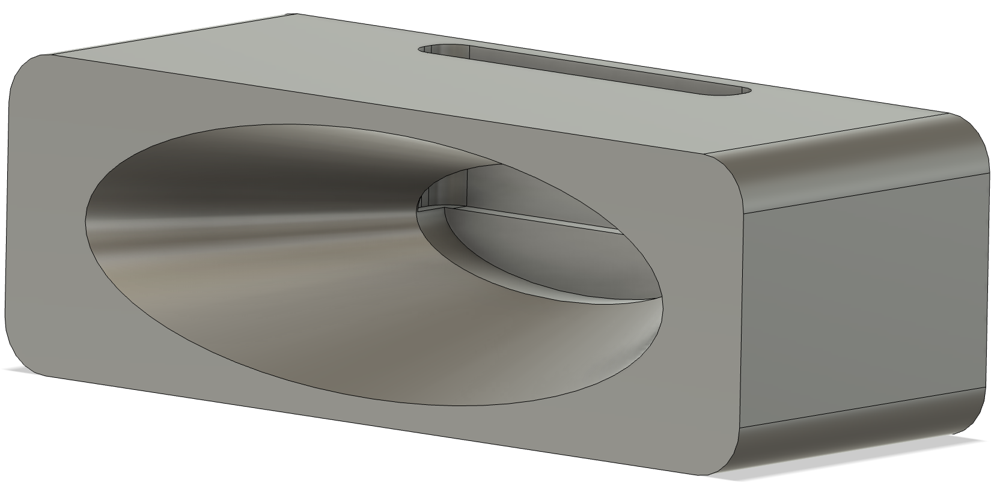

---

# Shop Tooling & Organization
Projects developed for the UCSD machine shop to improve workflow, accessibility, and shop organization.

## Laser-Cut Collet Holder — Acrylic
Designed a compact collet organizer for the shop's lathe and mill stations. Collets were previously stored loosely in drawers, making setup preparation inefficient. Laser-cut acrylic panels with aligned hole patterns keep collets sorted by size, visible, and easily accessible during tool changes.

  
  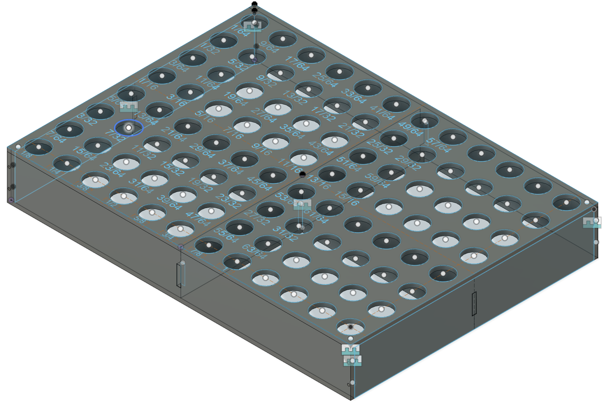

---

## Torque Wrench Holder
Designed a wall-mounted holder to keep torque wrenches visible, organized, and protected between setups.

  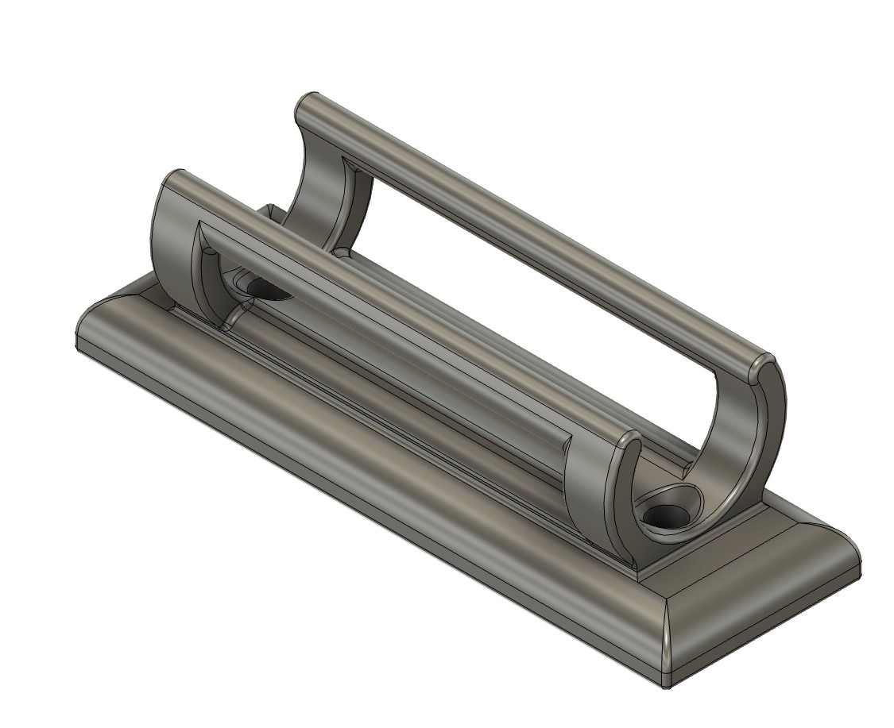

