# Portfolio
## Lucca Nogueira Frey
 
Mechanical engineer and hands-on machinist focused on CNC manufacturing, design for manufacturability (DFM), tooling development, and prototype aerospace hardware. This portfolio highlights selected projects spanning regeneratively cooled rocket engine machining, aerospace welding tooling, CAM programming, and shop tooling.
 
---
 
# SEDS UCSD — Regeneratively Cooled Rocket Chamber
**Rocket Propulsion Team — Lead Machinist**
 
Led machining of the Moonshine liner, the regeneratively cooled combustion chamber for the team's liquid rocket engine. The part is roughly 9.7 in. long and 3.5 in. in diameter, and it required deep internal boring, precision external contouring, and 50 indexed slitting cuts to form the cooling channels around the chamber and throat.
 
I programmed the toolpaths in Fusion 360 and proved out every setup on an aluminum prototype first. Internal and external profiling ran on a Haas TL-1 lathe, and the cooling channels were cut with a slitting saw on a Haas VF-2 4th axis. Once the setups were dialed in, the lathe operations ran about 2 hours per part and the 4th-axis channel work about 4 hours.
 
The final copper chamber, built on the toolpaths and setups proven on the aluminum prototype, completed a 15+ second static fire in June 2026 with only minor surface erosion and no burn-through.
 
---
 
## Static Fire Test
Copper chamber during its 15+ second static fire test, June 2026.
 

  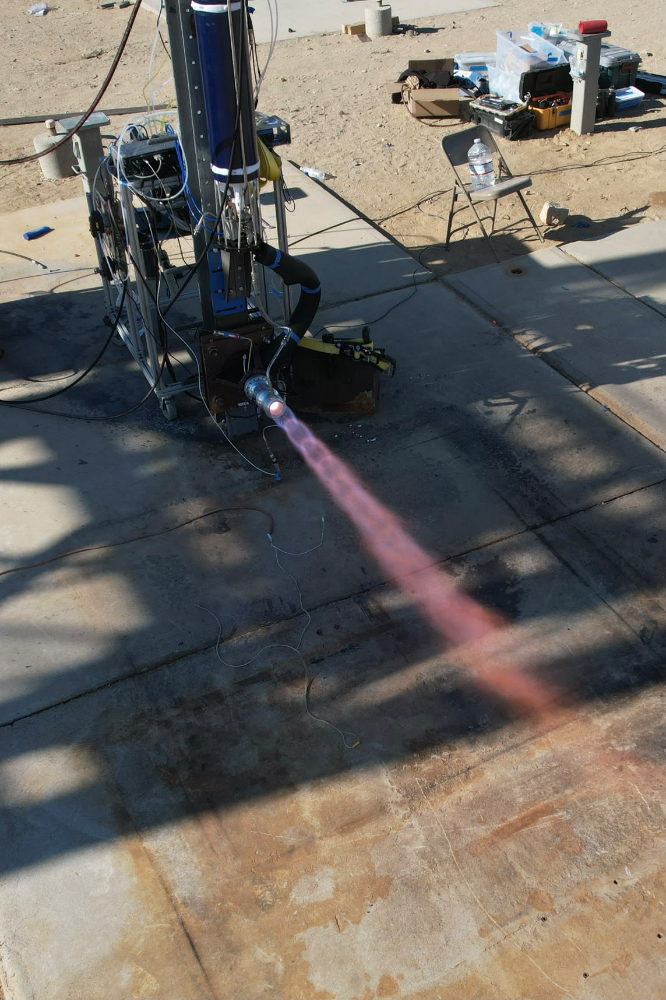

---
 
## Engineering Drawing
Liner drawing from the propulsion design team, specifying C101 copper, the throat and chamber contour, and the cooling channel geometry.
 

  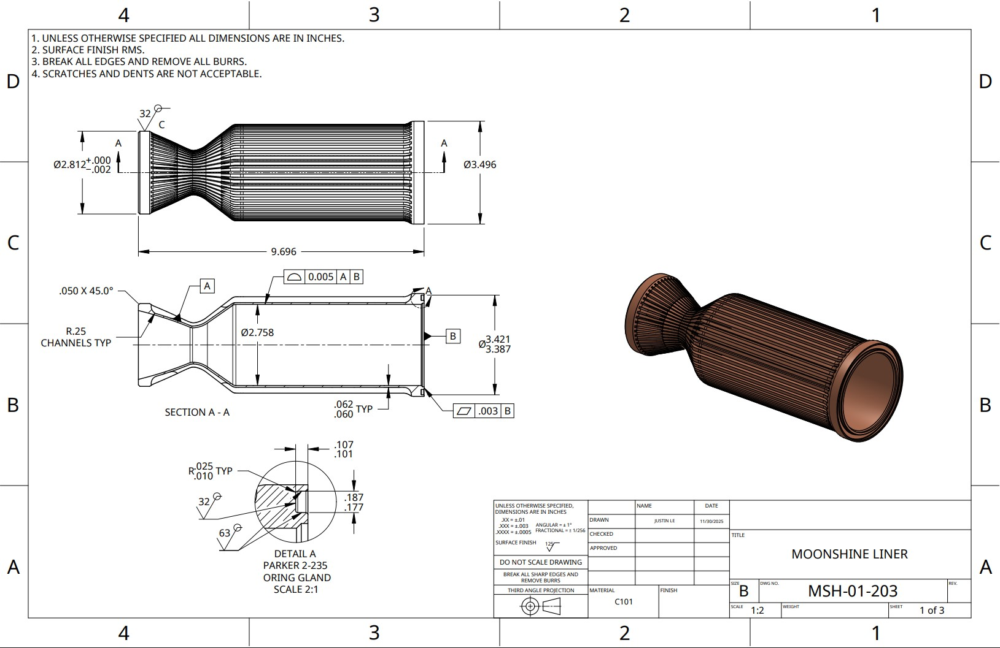

---
 
## Chamber Before Cooling Channel Machining
Initial external turning and contour profiling completed on the lathe before moving to 4th-axis machining.
 

  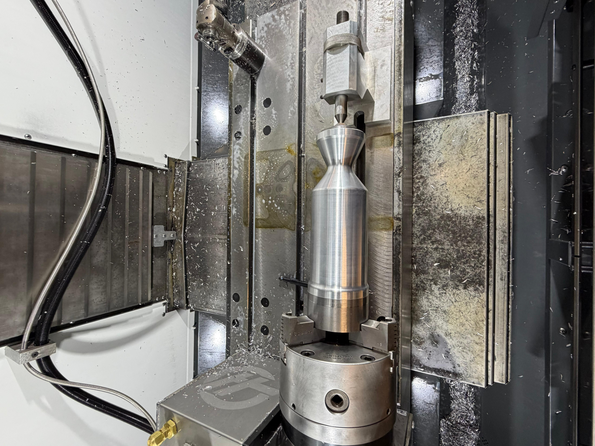

---
 
## TL-1 Internal Profiling Operations
Deep internal boring and contour profiling on the TL-1 lathe.
 

  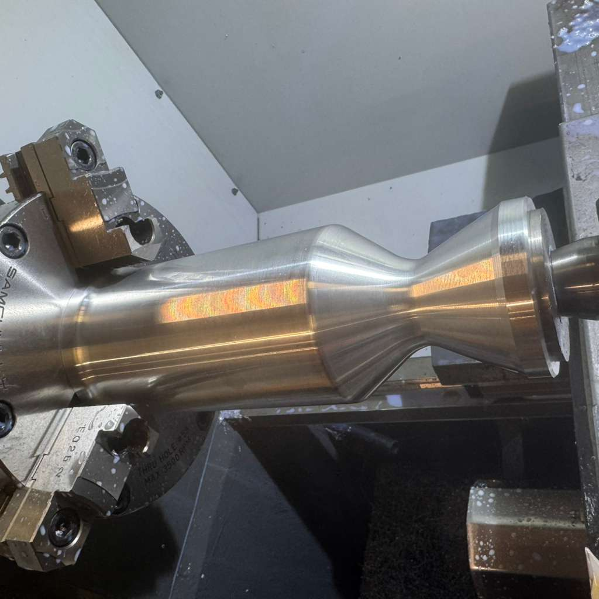

---
 
## VF-2 4th-Axis Setup
Custom fixture doubling as the tailstock, supporting the chamber during indexed slitting of the regenerative cooling channels.
 

  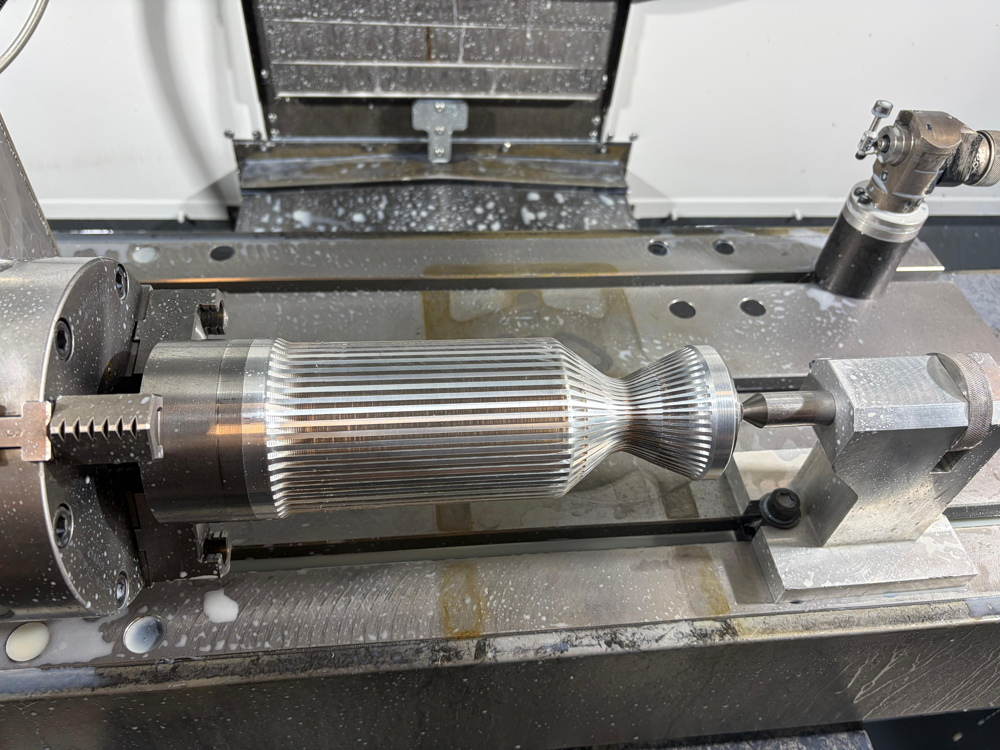

---
 
## Cooling Channel Machining Close-Up
Detail view of the regenerative cooling channels after 4th-axis slitting.
 

  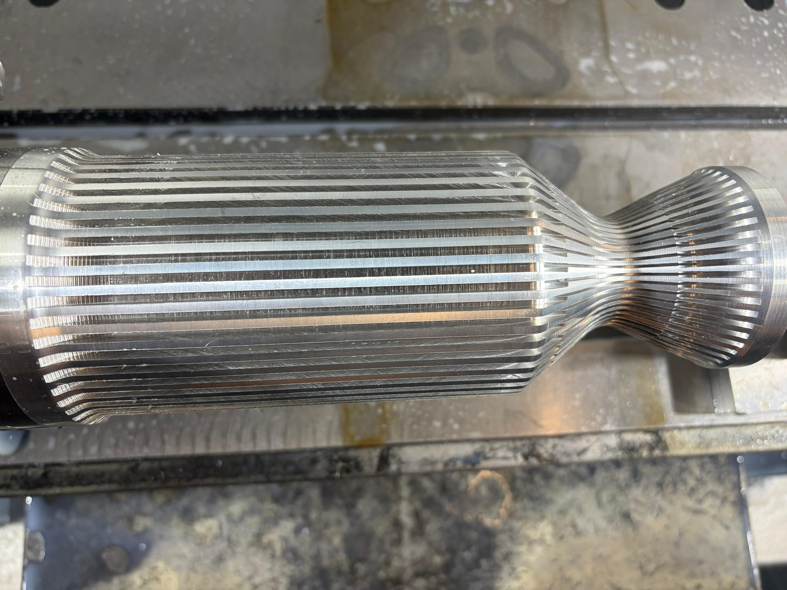

---
 
## Aluminum Prototype
Completed aluminum prototype after contour profiling and cooling channel machining. This part proved out the toolpaths, fixturing, and setups before moving to copper.
 

  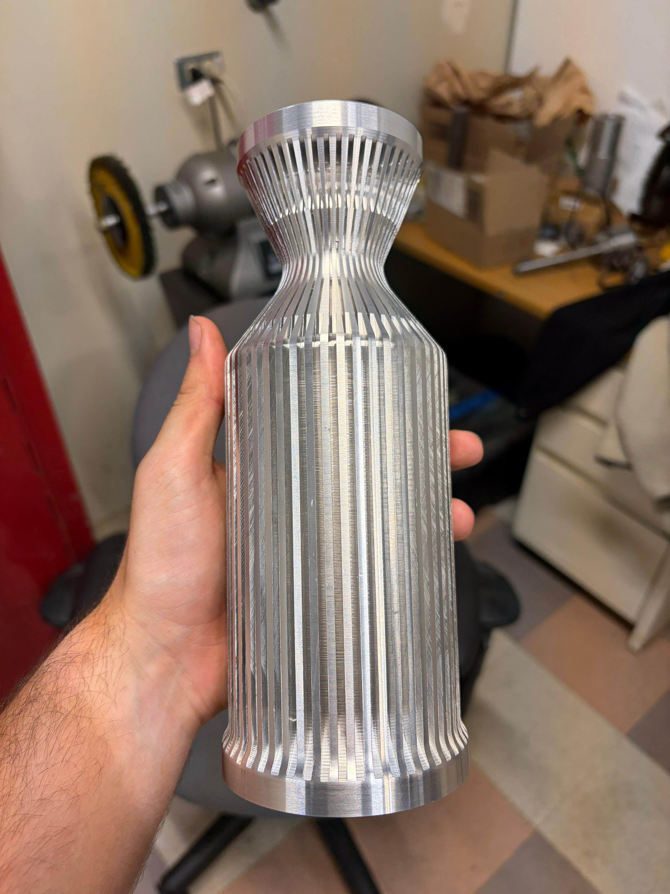

---
 
## Moving to Copper
Copper test piece with trial cooling channel cuts (left) next to a turned copper chamber blank before 4th-axis channel machining (right).
 

  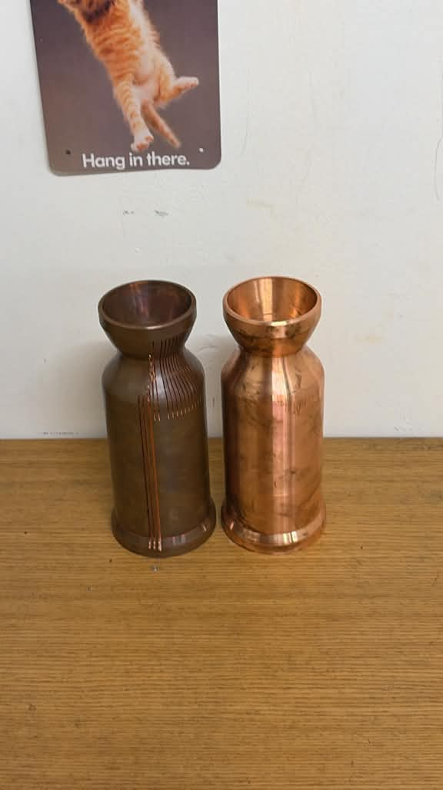

---
 
## Manufacturing Challenges and Solutions
- **Deep internal boring:** Chatter in the 8 in. deep bore was controlled by switching to a carbide boring bar and damping the bar with putty.
- **Workholding on the 4th axis:** The chuck could not clamp directly on the thin walls, and a standard tailstock would not work because the center of the chamber is machined out. I designed a fixture that holds the chamber and doubles as the tailstock.
- **Slitting saw selection and chatter:** I used Fusion 360 CAM simulation to pick the saw diameters that followed the channel toolpaths best, then designed 3 arbor holders (one for a 1 in. saw and two for 1.5 in. saws) that clamp nearly the whole saw, leaving only the depth of cut exposed to reduce chatter.
- **Thin-wall vibration:** The chamber was packed with plastic chips during slitting to damp vibration in the thin walls.
- **Concentricity:** The chamber was aligned on the lathe chuck and on the 4th axis at every setup to keep the bore and cooling channels concentric.
- **Consistent channel spacing:** Indexed 4th-axis operations kept all 50 channels evenly spaced across the full chamber contour.
---
 
# Honeycomb Welding Electrode System
**Hi Tech Honeycomb — UCSD Senior Design Program**
 
Designed, tooled, and manufactured a modular welding electrode system for aerospace honeycomb panel production. The original welding tips cost approximately $700 each and were sourced externally. I redesigned the system as press-fit copper assemblies that could be fabricated in-house, reducing the cost to approximately $41 per unit.
 
The initial approach attempted to preserve the existing threaded tip design. I started with a copper block that held two of the original threaded tips at 1/8" spacing. This failed for several reasons: the threading was unreliable and often out of tolerance, machining the male threads in-house was difficult, and the geometry created intersecting internal features that made the part impossible to manufacture reliably.
 
That led to a full redesign using press-fit connections. Press-fit solved the geometric constraint, eliminated threading tolerance issues, and maintained reliable electrical contact for welding. At the same time, we moved away from the existing tack welders entirely and built a custom PLC-controlled setup, which gave us the freedom to redesign the electrode system from scratch.
 
---
 
## Modular 5-Tip Welding Tool
The core of the system is a press-fit assembly supporting five welding tips for simultaneous multi-cell welding. This replaced a single-tip approach, reducing cycle time and improving alignment consistency across honeycomb cells.
 

  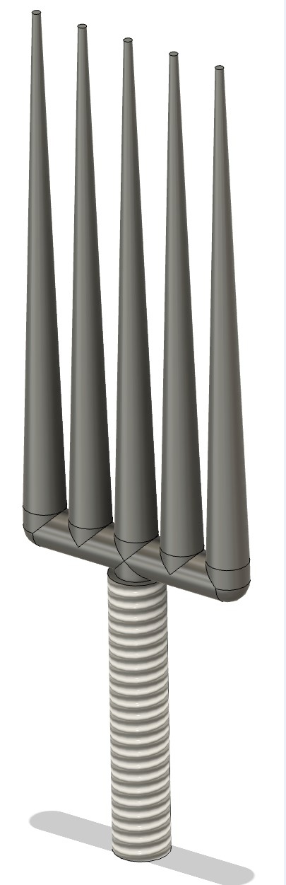

---
 
## Press-Fit Design and Technical Drawings
Each tip presses into a machined copper base block with about 0.001 in. of interference. The press-fit interface simplified assembly, reduced part count, and made tips quickly replaceable. Dimensioned GD&T drawings were used for in-house manufacturing and for quotes from outside vendors.
 
### Press-Fit Assembly (CAD Model)

  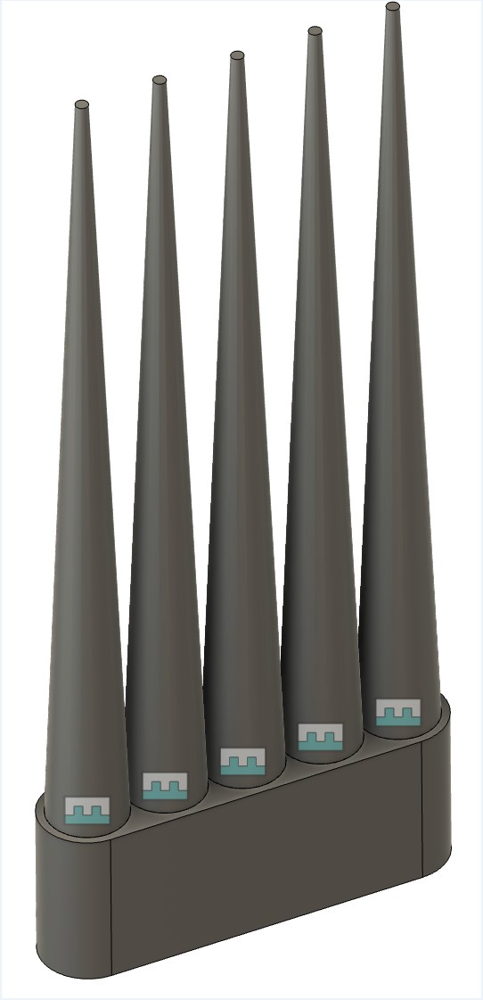

### Technical Drawings (Base + Tip)

  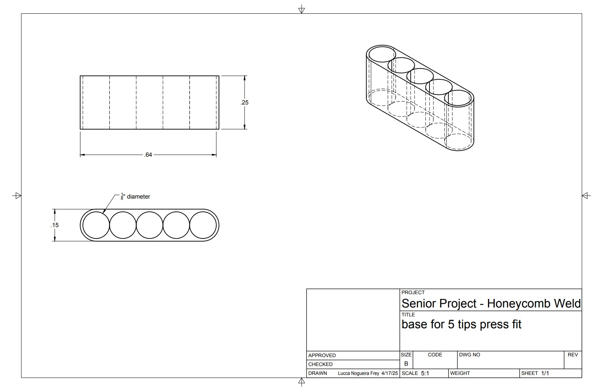
  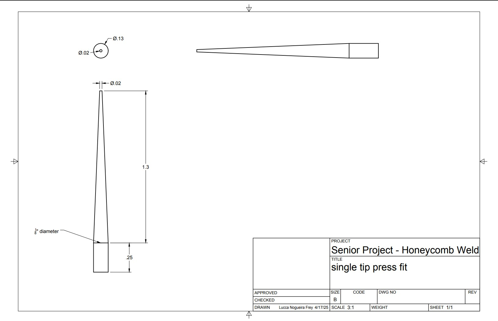

---
 
## Bending Mold for Tip Shaping
After machining, all five tips needed to be bent to match the honeycomb cell geometry. Bending by hand produced inconsistent angles, so I designed a precision mold that bends all five tips simultaneously. This ensured uniform angles across every set and made the bending process repeatable.
 

  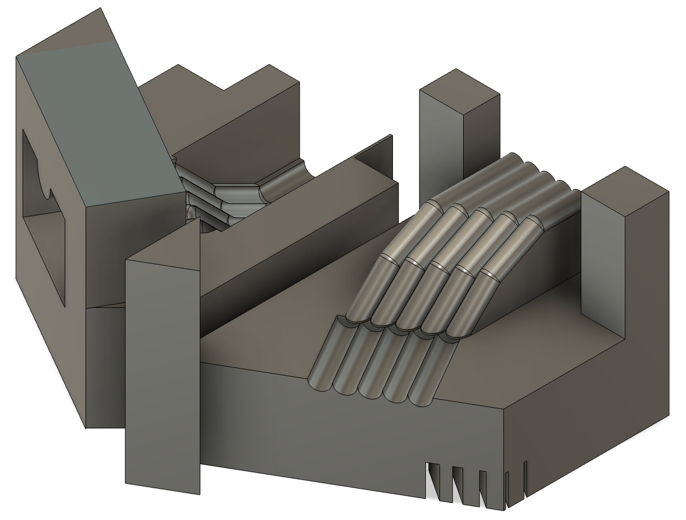

---
 
## Manufactured Result
Final copper tip assemblies, machined, press-fit into the base, and shaped using the bending mold. These replaced the externally sourced tips at a fraction of the original cost. Each assembly took about 45 minutes to make, and a batched process (machining bases and tips in groups) is projected to bring that down to 25 to 30 minutes.
 

  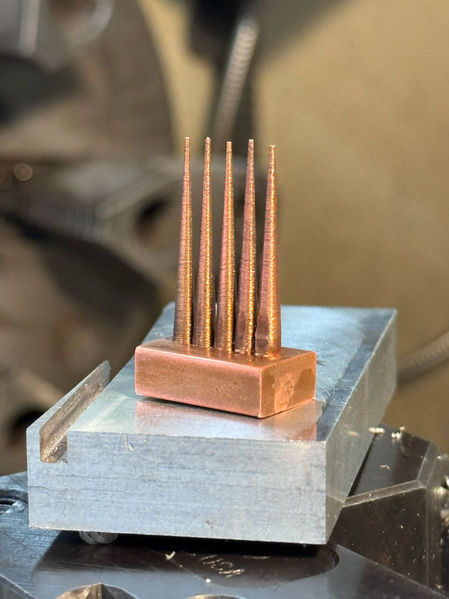
  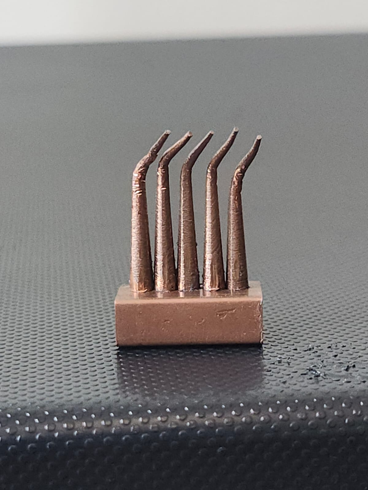

---
 
## Design Iterations — Alternate Tip Configurations
Beyond the 5-tip system, I designed alternate configurations to handle different welding access requirements on the honeycomb panels.
 
### Angled Three-Tip Branch
Designed for areas where the standard straight approach could not reach. The angled configuration accommodates tight and misaligned honeycomb structures.
 

  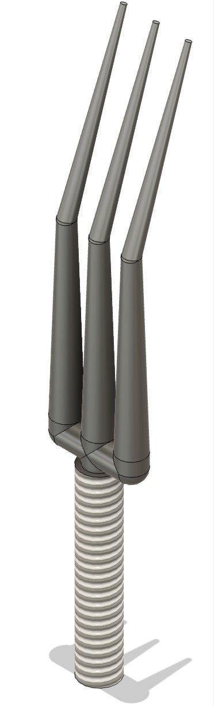

### Double-Tip Welding Holder
A consolidated two-tip holder for tack welding operations where fewer simultaneous welds were needed. Reduced cycle time compared to single-tip while keeping the system compact.
 

  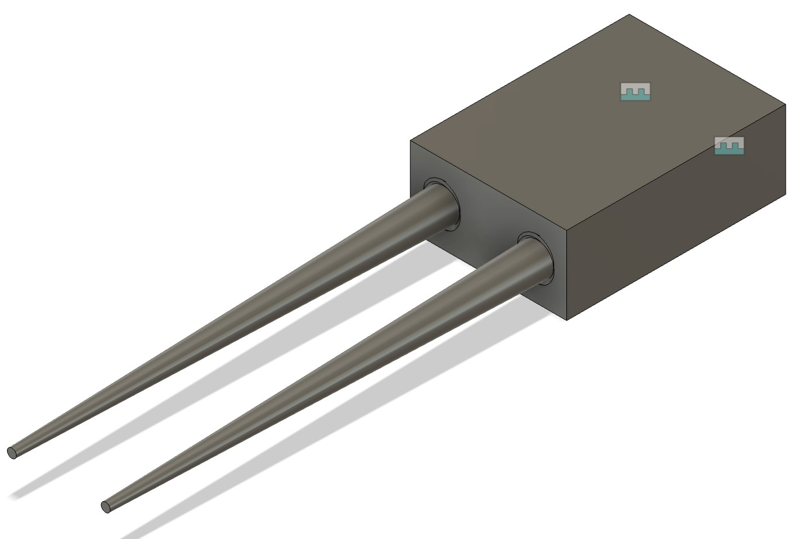

---
 
# CNC Machined Passive Phone Speaker — Haas MiniMill
 
Designed and machined an aluminum passive phone speaker from scratch using Fusion 360 CAD/CAM workflows. This project focused on multi-setup machining, contour surfacing strategies, toolpath development, and improving machining finish quality on curved geometry.
 
### In-Process (in vise)

  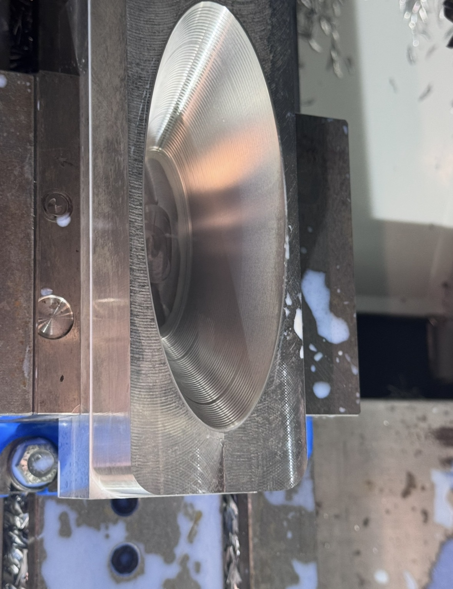

### CAM Toolpaths (Fusion 360)

  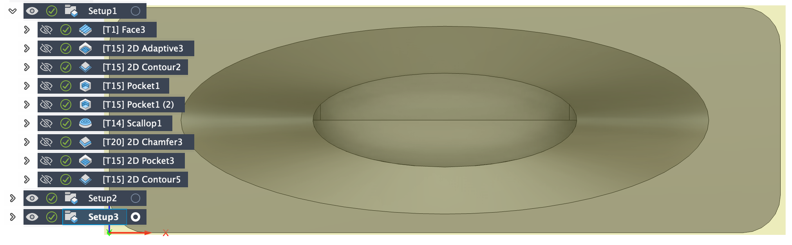

### CAD Model (Fusion 360)

  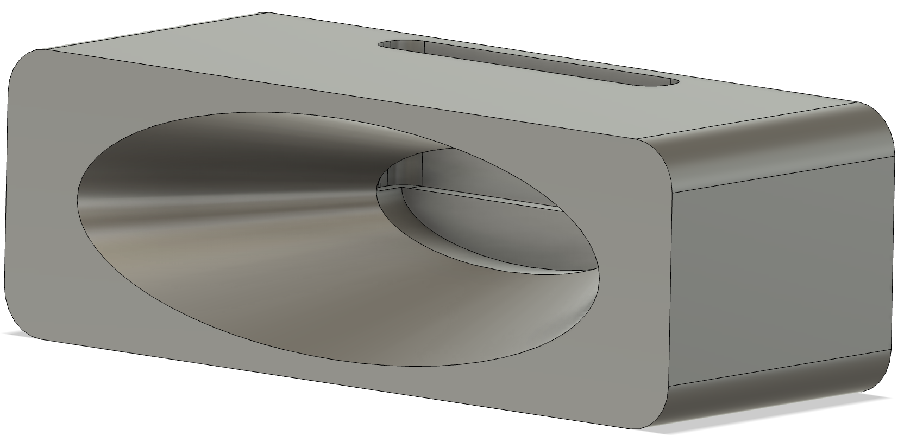

---
 
# Shop Tooling & Organization
 
Projects built for the UCSD machine shop to improve workflow, organization, and tool accessibility.
 
## Laser-Cut Collet Holder — Acrylic
 
Designed a compact collet organizer for the shop's lathe and mill stations. Collets were previously stored loose in drawers, making it difficult to quickly identify the correct size during setups. Laser-cut acrylic panels with aligned hole patterns keep collets sorted, visible, and accessible during machining operations.
 

  
  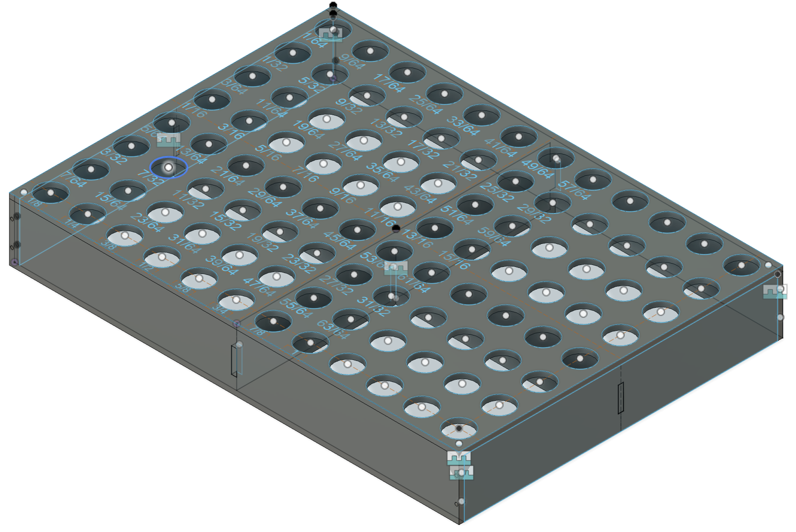

---
 
## Torque Wrench Holder
 
Designed a wall-mounted holder to keep torque wrenches visible, accessible, and secure. Built to reduce misplaced tooling and improve workstation organization within the machine shop.
 

  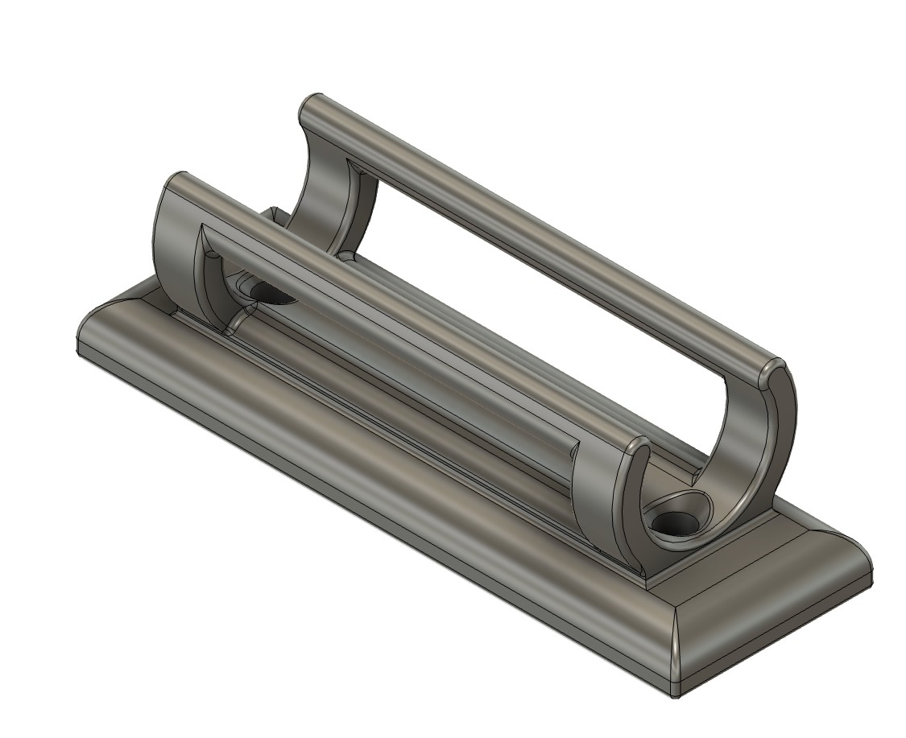

 
